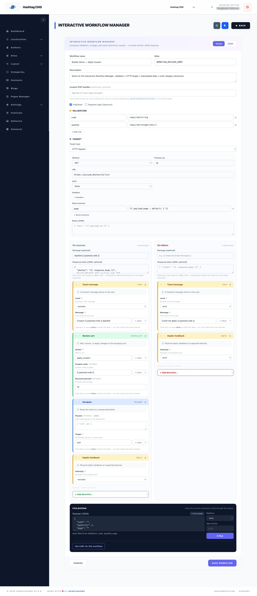
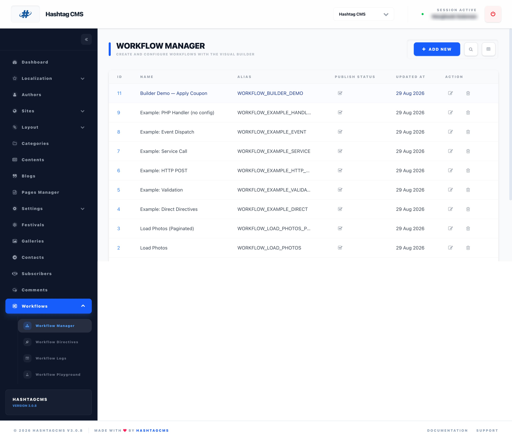

<p align="center">
  
</p>

<p align="center">
  A standalone, server-driven workflow &amp; action orchestration engine for <strong>HashtagCMS</strong>.
</p>

<p align="center">
  <a href="https://packagist.org/packages/hashtagcms/workflows"></a>
  
  
  
</p>

# HashtagCMS Workflows (`hashtagcms/workflows`)

## Why a Standalone Package?
- **Zero Bloat in Core**: Keeps `hashtagcms/hashtagcms` lightweight and focused solely on core CMS features.
- **Opt-in Extended Capability**: Projects install workflows only when they need complex business logic, multi-step checkout pipelines, coupon rules, and SDUI state machine orchestration.
- **Independent Lifecycle**: Can be versioned, tested, and expanded without impacting core CMS stability.

---

## 🚀 Key Features

- **Server-Driven Directives**: The backend executes business logic and returns structured client directives (`toast`, `mutate_cart`, `open_sheet`, `navigate`, `haptic`, …) — a catalog of 72 predefined directive types.
- **Database-Backed Workflows**: Workflows are stored in the `workflows` table and dynamically loaded or mapped to custom PHP pipeline handlers.
- **Visual Workflow Manager**: The workflow editor is a Vue-based visual builder (validation, target, and directive builders, drag-to-reorder, live preview) with a raw-JSON tab always available. See [docs/13](docs/13-interactive-workflow-manager.md).
- **Directive Capability Negotiation**: The engine emits only the directives a given client can render, downgrading or dropping the rest per a per-platform manifest. See [docs/12](docs/12-directive-capability-negotiation.md).
- **Audit & Analytics Logging**: Every workflow execution is recorded with execution timing (ms), user ID, session, payload, returned directives, and the negotiated client in `workflow_logs`.
- **Seamless Multi-Platform Support**: Built to seamlessly orchestrate Web SDK, Admin SDK, and Mobile SDUI apps (Compose Multiplatform / Swift / React Native).

---

## 📚 Documentation

Full technical documentation lives in [`docs/`](docs/README.md):

| Guide | Topic |
| --- | --- |
| [Architecture Overview](docs/01-architecture-overview.md) | SDUI pipeline, Context & Directive Response model. |
| [Installation & Setup](docs/02-installation-and-setup.md) | Requirements, provider discovery, migrations, config. |
| [Admin Panel Management](docs/03-admin-panel-management.md) | Creating and managing workflows in the Admin UI. |
| [Creating Custom Workflows](docs/04-creating-custom-workflows.md) | Implementing `WorkflowHandlerInterface` and registering aliases. |
| [Example Workflows & Generators](docs/05-built-in-workflows-catalog.md) | `make:workflow`, `publish-examples`, and the four publishable example handlers. |
| [Headless API & Mobile Integration](docs/06-headless-api-and-mobile-integration.md) | Execution contract and client-side directive handling. |
| [Audit Logging & Analytics](docs/07-audit-logging-and-analytics.md) | Execution monitoring, benchmarks, and log pruning. |
| [Directive Capability Negotiation](docs/12-directive-capability-negotiation.md) | Manifest of supported directives, per-client resolution, fallbacks, and telemetry. |
| [Interactive Workflow Manager](docs/13-interactive-workflow-manager.md) | The Vue-based visual builder — panels, live preview, cURL, JSON escape hatch, and how it's built. |

End-to-end examples: [Apply Promo](docs/08-example-apply-promo-workflow.md) · [Add to Cart](docs/09-example-add-to-cart-workflow.md) · [Appointment Booking](docs/10-example-appointment-booking-workflow.md) · [OTP Verification](docs/11-example-otp-verification-workflow.md).

---

## 🧩 Creating & publishing workflows

The package ships **no pre-registered PHP handlers** — your app owns its
workflow logic. There are three ways to get a workflow:

**1. Scaffold your own** (the common path):

```bash
php artisan make:workflow ApplyCoupon --alias=WORKFLOW_APPLY_COUPON
```

This creates `app/Workflows/ApplyCoupon.php` implementing
`WorkflowHandlerInterface`, and prints the one line to register it.

**2. Publish the bundled examples** as editable starting points:

```bash
php artisan hashtagcms-workflows:publish-examples
```

This copies four example commerce handlers into `app/Workflows/Examples/`
(`AddToCartWorkflow`, `ApplyCouponWorkflow`, `QuickReorderWorkflow`,
`SubmitFeedbackWorkflow`) and prints their register lines.

**3. Define them declaratively** as `workflows` table rows (no PHP) — see the
example seeders below.

Register a PHP handler in a service provider (e.g. `AppServiceProvider::boot`):

```php
use HashtagCms\Workflows\Facades\Workflows;

Workflows::register('WORKFLOW_APPLY_COUPON', \App\Workflows\ApplyCoupon::class);
```

See [Example Workflows & Generators](docs/05-built-in-workflows-catalog.md) for
the published examples' payload shapes and returned directives.

---

## 📦 Installation

In your Laravel project running HashtagCMS:

```bash
composer require hashtagcms/workflows
php artisan migrate
```

That single `migrate` provisions the whole package: the admin modules
(**Workflows** → Manager, Directives, Logs, Playground), the **directive
capability manifest** (72 predefined directives), and the **bundled example
workflows** — no separate seed step. To install the schema without the
demo workflows, set `HASHTAGCMS_WORKFLOWS_SEED_EXAMPLES=false` before migrating.

### Re-seeding the example workflows

The examples seed automatically on install; to re-apply them later (e.g. after
edits) they are also runnable as a seeder (safe to re-run — upserted by alias):

```bash
php artisan db:seed --class="HashtagCms\Workflows\Database\Seeders\WorkflowExamplesSeeder"
```

This is the **catalog of example workflows**, one per structural pattern — read
them in `src/Database/Seeders` to learn the whole config shape:

| Alias | Pattern it demonstrates |
| --- | --- |
| `WORKFLOW_LOAD_PHOTOS` | HTTP **GET** `target` → return the JSON array response + a toast. |
| `WORKFLOW_LOAD_PHOTOS_PAGED` | HTTP GET with **query** params (`page`/`limit`) forwarded from the payload, with validation and defaults. |
| `WORKFLOW_EXAMPLE_DIRECT` | **No external call** (`target: none`) → return client directives: `toast`, `navigate`, `open_sheet`, `haptic`. |
| `WORKFLOW_EXAMPLE_VALIDATION` | **Validation** with `rules` + `messages` + `on_error` directives (uses `{{ errors.* }}`). |
| `WORKFLOW_EXAMPLE_HTTP_POST` | HTTP **POST** with a body, **bearer auth**, response interpolation, and an `on_failure` branch. |
| `WORKFLOW_EXAMPLE_SERVICE` | **service** target → calls a PHP method (`DemoInventoryService::check`). |
| `WORKFLOW_EXAMPLE_EVENT` | **event** target → dispatches a Laravel event (`DemoWorkflowEvent`). |
| `WORKFLOW_EXAMPLE_HANDLER` | **PHP handler** (no config) → logic lives entirely in a `WorkflowHandlerInterface` class. |
| `WORKFLOW_BUILDER_DEMO` | **Everything at once** → validation + HTTP target + interpolated `data` (`{{ response.body }}`) + multi-category directives. The showcase for the Interactive Workflow Manager. |

Try a few:

```bash
# Paginated HTTP GET
curl -X POST /api/hashtagcms/public/workflows/v1/execute -H "Content-Type: application/json" \
  -d '{"workflow":"WORKFLOW_LOAD_PHOTOS_PAGED","payload":{"page":2,"limit":4}}'

# Validation failure (returns a friendly error toast)
curl -X POST /api/hashtagcms/public/workflows/v1/execute -H "Content-Type: application/json" \
  -d '{"workflow":"WORKFLOW_EXAMPLE_VALIDATION","payload":{}}'

# Service call
curl -X POST /api/hashtagcms/public/workflows/v1/execute -H "Content-Type: application/json" \
  -d '{"workflow":"WORKFLOW_EXAMPLE_SERVICE","payload":{"sku":"ABC-9","quantity":2}}'
```

Seed a single group by pointing `--class` at `LoadPhotosWorkflowSeeder`,
`LoadPhotosPaginatedWorkflowSeeder`, or `WorkflowStructureExamplesSeeder`.

### Playground

Once installed, the admin panel gains a **Workflow Playground** page
(`admin/workflows/playground`, under the *Workflows* menu). It lists every
published workflow, lets you edit a payload and **Run** it against the execute
endpoint, and shows both the **rendered directives** (toasts, welcome banner,
photo grid…) and the **raw request/response JSON** — the quickest way to see the
server-driven model in action after install.

---

## 🛠️ Defining a Custom Workflow Handler

Create a class implementing `HashtagCms\Workflows\Contracts\WorkflowHandlerInterface`:

```php
namespace App\Workflows;

use HashtagCms\Workflows\Contracts\WorkflowHandlerInterface;
use HashtagCms\Workflows\Engine\WorkflowContext;
use HashtagCms\Workflows\Engine\WorkflowResponse;

class BookAppointmentWorkflow implements WorkflowHandlerInterface
{
    public function handle(WorkflowContext $context): WorkflowResponse
    {
        $slotId = $context->get('slotId');
        $patientName = $context->get('name');

        // 1. Process business logic / DB transaction
        // ...

        // 2. Return client directives
        return WorkflowResponse::make()
            ->toast("Appointment booked for {$patientName}!", 'success')
            ->navigate('appointment-confirmation', ['slotId' => $slotId])
            ->haptic('success');
    }
}
```

---

## 🌐 API Endpoint

### Execute Workflow
`POST /api/hashtagcms/public/workflows/v1/execute`

**Request Body:**
```json
{
  "workflow": "WORKFLOW_APPLY_COUPON",
  "payload": {
    "code": "DOM50"
  },
  "site_id": 1,
  "platform": "android"
}
```

**Response:**
```json
{
  "success": true,
  "message": null,
  "directives": [
    {
      "type": "mutate_cart",
      "action": "apply_coupon",
      "couponCode": "DOM50",
      "discountPercent": 50,
      "maxDiscount": 100,
      "label": "50% OFF (up to ₹100)"
    },
    {
      "type": "toast",
      "message": "🎉 Coupon 'DOM50' applied! 50% OFF (up to ₹100)",
      "level": "success"
    },
    {
      "type": "haptic",
      "intensity": "success"
    }
  ],
  "data": {
    "coupon": {
      "discountPercent": 50,
      "maxDiscount": 100,
      "label": "50% OFF (up to ₹100)"
    }
  }
}
```
## Screenshots

### Workflows Editor


### Workflows List

